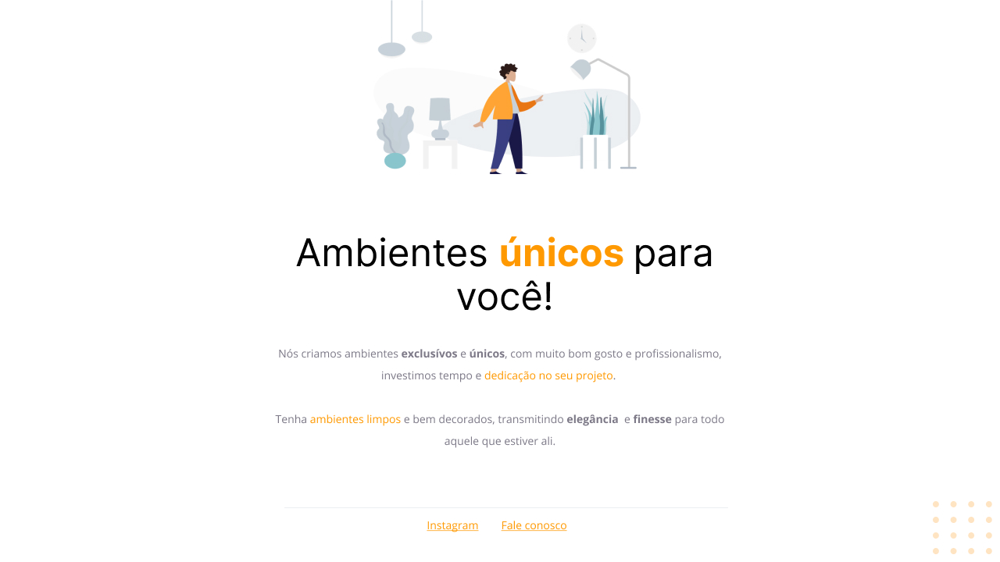

  <h1 align="center"> Explorer Stage 02 - Exclusive Environments 📝</h1>

## ✏️ About

> This is my very first web development project, and it is a part of Stage 02 of the Explorer course at Rocketseat. As I am still at the very beginning of my studies, this project only uses HTML and CSS technologies. It represents an exciting challenge as I embark on my journey to learn and grow in the world of web development.🚀

## ⚙ Technologies

 

  
  

 

## 💻 Project

To access the project, click the link below:

[🔗 Click here to access](https://github.com/juliannalencar/dev-web_explorer/tree/main/ex01_exclusive-environments)

## 🎨 Layout

To access the project layout on Figma, click the link below:

🔗 [View on Figma](https://www.figma.com/file/dsHnSnvH9GsoyNieeQ4rBH/Explorer-Projeto-01-Copy?fuid=1301745258112043399)

## 📫 Contact

  
  
  

 

<h4 align="center">Made with 💙 by Julianna D. Alencar 👋🏻</h4>